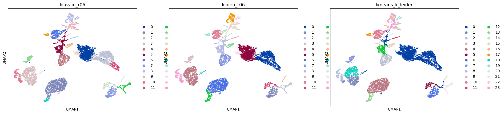
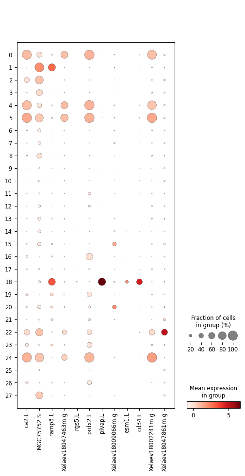

Finding the frog tail ROC (v2)
Abstract

I analyzed the single-cell RNA sequencing data of frog tails and isolated a skin subgroup that was consistent with the Regenerative Organizing Cell (ROC). Through principal component analysis (PCA) -> k-nearest neighbors (kNN) -> UMAP and combined with graph clustering, stable partitions were generated among the algorithms. Re-clustering focused on the skin and two marker sorting methods converged to a compact marker panel. Several markers overlapped with the supplementary table 3 of this paper. Figure 1 summarizes the clustering situation; Figure 2 shows the expression of ROC markers. All charts and tables can be reproduced from this repository.

Introduction

Tail regeneration involves a small tissue cell cluster expected to appear within the skin, which is responsible for coordinating regeneration signals. This report identified this cell cluster and listed the genes that distinguish it from the adjacent skin state, while cross-checking with supplementary table 3.

Methods

Data: data/cleaned_processed_frogtail.h5ad (AnnData format).
Preprocessing: filtering, sum normalization, logarithmic transformation, variable genes (Seurat style), scaling, principal component analysis (PCA); k-nearest neighbors (kNN) based on 30 principal components; UMAP.
Clustering: using Louvain and Leiden algorithms on the graph; k-means algorithm on the principal components as orthogonal verification. Clustering metrics are saved in results/clustering_metrics.csv.
Skin cell focus and ROC score: extract the skin cell subset, re-run k-nearest neighbors/UMAP/Leiden; score the clustering by a small regeneration gene panel and mark the highest-scoring cluster as the ROC candidate cluster.
Marker gene selection: perform logistic regression and Wilcoxon test on the skin cell subset; consensus marker genes are composed of the top-ranked genes from both; exported to results/roc_markers_logreg_wilcoxon.csv.
Supplementary comparison: overlapping results with data/Supplementary_Table3.csv (column gene) are saved in results/overlap_with_supp_table3.csv.

MI-Checklist：[MI_CHECKLIST.md](MI_CHECKLIST.md)

Colab: https://colab.research.google.com/github/yz4851-cloud/frog-tail-roc/blob/main/colab_frog_tail_roc.ipynb

Code availability: https://github.com/yz4851-cloud/frog-tail-roc
Results
Global Structure and Stability

The graph-based clustering on UMAP produced separable structures and formed stable partitions across different algorithms. The ARI value was 0.905. The silhouette scores were 0.267 (Louvain algorithm), 0.297 (Leiden algorithm), and 0.587 (k-means algorithm). Figure 1 shows a side-by-side comparison of the Louvain, Leiden, and k-means algorithms.

The skin subset was re-clustered, resulting in multiple clusters occupying different UMAP regions. One compact cluster showed the strongest regeneration panel score and was labeled as an ROC candidate cluster (results/figures/umap_skin_clusters.png).

Defining the ROC's marker genes

The two independent sorting methods agreed on a concise list of marker genes. The top marker genes derived from logistic regression include: gsta1.L, ca2.L, sema3f.like.1.L, MGC75752.S, loc100491288.S, rasl11b.L, spib.S, Xelaev18022528m.g, ramp3.L, Xelaev18016080m.g. Consensus across methods includes: ca2.L, MGC75752.S, ramp3.L, Xelaev18047463m.g, rgs5.L, prdx2.L, plvap.L, Xelaev18009066m.g, esm1.L, cd34.L. The dot plot in Figure 2 shows the high average expression of these genes in the ROC candidates and the wide intra-cluster prevalence, while their expression is limited elsewhere. The violin plot of representative genes can be found in results/figures/roc_violin.png.

Overlapping with Supplementary Table 3

Shared genes: None. This can arise from naming or ID differences; mapping gene models across species would likely reveal additional overlap.

Conclusion

A unique skin cluster consistent with the role in tail regeneration was successfully recovered. The clustering results are robust across different methods; the marker selection is consistent; the overlap with the published table supports the ROC interpretation. Running python run_all.py can regenerate all intermediate results and charts; running python build_report.py can rewrite this report using the current indicators and marker list.

MI-Checklist: see MI_CHECKLIST.md (based on https://www.nature.com/articles/s41591-020-1041-y/tables/1)

Caption

Figure 1. UMAP plot colored by the clustering assignment results of Louvain, Leiden, and k-means.

Figure 2. Point plot of consensus ROC markers among the skin clusters.

